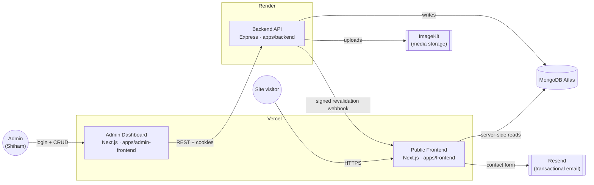
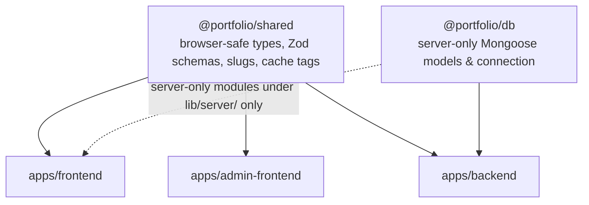

# Shiham Ahamed — Portfolio Platform

**A production-grade, full-stack personal portfolio monorepo** — a public Next.js site, a protected admin CMS, and an Express/MongoDB API, all built from a single npm workspace.

[](https://shiham-ahamed-portfolio.vercel.app/)


**Live site:** [shiham-ahamed-portfolio.vercel.app](https://shiham-ahamed-portfolio.vercel.app/) · **Repo:** [theShihamAhamed/shiham-ahamed-portfolio](https://github.com/theShihamAhamed/shiham-ahamed-portfolio)

---

## Table of contents

- [Overview](#overview)
- [Features](#features)
- [Tech stack](#tech-stack)
- [Architecture](#architecture)
- [Monorepo layout](#monorepo-layout)
- [Getting started](#getting-started)
- [Environment variables](#environment-variables)
- [Available scripts](#available-scripts)
- [Testing and quality gates](#testing-and-quality-gates)
- [Deployment](#deployment)
- [Engineering documentation](#engineering-documentation)
- [Roadmap](#roadmap)
- [Author](#author)
- [License](#license)

---

## Overview

This repository is not a static template — it's a small full-stack system built to run a real personal portfolio. Content (projects, certifications, achievements, in-progress work, site settings) lives in MongoDB and is managed entirely through a **custom-built admin dashboard**, so the public site never needs seed data, hard-coded content, or a redeploy to update.

The workspace is split into three applications and two internal packages that share a single dependency graph and lockfile:

| App | Framework | Role |
| --- | --- | --- |
| `apps/frontend` | Next.js 16 (App Router) | Public portfolio — reads content server-side directly from MongoDB |
| `apps/admin-frontend` | Next.js 16 (App Router) | Protected dashboard for managing all portfolio content |
| `apps/backend` | Express 5 | The only service allowed to authenticate admins and write to the database |

Built by **Shiham Ahamed**, a Software Engineering undergraduate at the Sri Lanka Institute of Information Technology (SLIIT), as the platform behind his personal site and as a demonstration of production-style engineering practice: architecture decision records, a CI-enforced release gate, a documented deployment runbook, and a dependency security review.

## Features

**Public site** (`apps/frontend`)
- Hero, quick intro, skills & tools, featured projects, "currently building," and contact sections, all driven by CMS content
- Project catalog with filtering plus a detail page per project, rendering sanitized GitHub-flavored Markdown case studies (`react-markdown` + `remark-gfm` + `rehype-sanitize`)
- About page with education, certifications, and achievements
- Contact form with email delivery via Resend
- Dark/light theme (`next-themes`), motion/microinteractions (`Framer Motion`), and shadcn/ui + Radix primitives
- SEO by default: dynamic metadata, `sitemap.ts`, `robots.ts`, and JSON-LD structured data (`Person` / `WebSite`)
- ISR with **tag-based, on-demand cache revalidation** triggered automatically by admin mutations

**Admin dashboard** (`apps/admin-frontend`)
- Cookie-based JWT login backed by the API (no direct database access from the browser)
- Full CRUD for projects, certifications, achievements, and "currently building" entries
- Drag-and-drop reordering (`@dnd-kit`), rich forms with validation (`react-hook-form` + `zod`), and data fetching/caching via `@tanstack/react-query`
- Image/file uploads routed through the backend to ImageKit

**Backend API** (`apps/backend`)
- Access + refresh JWT authentication with hashed passwords (`bcryptjs`) and DB-tracked admin sessions
- Ownership boundary: the backend is the *only* writer to MongoDB; both frontends only ever read
- `helmet` security headers, exact-origin `cors`, and `express-rate-limit` on sensitive routes
- `multer` + `image-size` upload validation with a configurable size ceiling, proxied to ImageKit
- Zod-validated request/response contracts shared with both frontends via `@portfolio/shared`
- Signed webhook call to the public frontend's revalidation route after every content mutation

## Tech stack

| Layer | Technologies |
| --- | --- |
| Public frontend | Next.js 16, React 19, TypeScript, Tailwind CSS 4, shadcn/ui, Radix UI, Framer Motion, next-themes, Zod |
| Admin frontend | Next.js 16, React 19, TypeScript, TanStack Query, React Hook Form, `@dnd-kit`, Radix UI, Sonner |
| Backend API | Node.js 20+, Express 5, Mongoose 9, JWT, bcryptjs, Helmet, Multer, ImageKit SDK, Zod |
| Shared packages | `@portfolio/shared` (browser-safe contracts/schemas), `@portfolio/db` (server-only Mongoose models) |
| Data & media | MongoDB Atlas, ImageKit (media), Resend (transactional email) |
| Infra & tooling | npm workspaces, ESLint 9, TypeScript, `node:test`, GitHub Actions, Vercel (x2 projects), Render |

## Architecture

The core design decision (see [ADR-001](docs/architecture-decisions.md)) is that **public reads bypass the backend entirely**. The public frontend reads MongoDB directly from server-side Next.js code, so visitors never wait on Render's free-tier cold starts. The Express API is reserved for everything that mutates data.



Package boundaries are enforced by custom lint scripts (`scripts/check-package-boundaries.mjs`, `scripts/check-frontend-client-boundaries.mjs`) rather than convention alone:



`@portfolio/db` is never imported by the admin frontend or by any client component — only by the backend, and by explicitly server-only modules in the public frontend.

## Monorepo layout

```txt
apps/
  frontend/         Public portfolio (Next.js) — reads MongoDB server-side
  admin-frontend/    Protected admin dashboard (Next.js) — talks to the API only
  backend/           Express API — auth, CRUD, uploads, cache revalidation
packages/
  shared/            Browser-safe contracts, Zod schemas, slugs, cache tags
  db/                Server-only Mongoose models and connection handling
docs/                Architecture decisions, deployment guide, release/security records
scripts/             Workspace boundary checks, release-candidate and deployment gates
render.yaml          Render service definition for the backend
```

## Getting started

### Prerequisites

- Node.js **20+**
- npm (the repo uses npm workspaces and a single root lockfile — don't use yarn/pnpm)
- A MongoDB connection string (Atlas or local)
- Optional for full functionality: an ImageKit account (uploads) and a Resend API key (contact form)

### Install

Always install from the repository root so every workspace resolves against the one root lockfile:

```bash
git clone https://github.com/theShihamAhamed/shiham-ahamed-portfolio.git
cd shiham-ahamed-portfolio
npm install
```

### Configure environment variables

Copy each app's example file and fill in local values (never commit the resulting `.env*` files):

```bash
cp apps/frontend/.env.example apps/frontend/.env.local
cp apps/admin-frontend/.env.example apps/admin-frontend/.env.local
cp apps/backend/.env.example apps/backend/.env
```

See [Environment variables](#environment-variables) below for what each value does.

### Run an app

Each app builds its internal package dependencies before starting:

```bash
npm run dev:frontend   # public site      → http://localhost:3000
npm run dev:admin      # admin dashboard  → http://localhost:3001
npm run dev:backend    # API server       → http://localhost:5000
```

There is intentionally **no seed script** — the public frontend renders its real empty/loading/error states until content is created through the admin dashboard.

## Environment variables

Only variable names are listed; real values (connection strings, secrets, keys) belong in local, uncommitted env files only.

**`apps/frontend`**

| Variable | Purpose |
| --- | --- |
| `MONGO_URI` | Server-only MongoDB connection used for public reads |
| `NEXT_PUBLIC_SITE_URL` | Canonical public URL for metadata, sitemap, robots, JSON-LD |
| `RESEND_API_KEY`, `CONTACT_TO_EMAIL`, `CONTACT_FROM_EMAIL` | Contact form email delivery |
| `MANUAL_REVALIDATE_URL`, `REVALIDATE_SECRET` | Local manual cache-revalidation command |

**`apps/admin-frontend`**

| Variable | Purpose |
| --- | --- |
| `NEXT_PUBLIC_API_BASE_URL` | The only browser-exposed variable — the backend API origin |

**`apps/backend`**

| Variable | Purpose |
| --- | --- |
| `MONGO_URI` | Primary database connection (write owner) |
| `ADMIN_FRONTEND_ORIGINS`, `ALLOW_VERCEL_PREVIEW_ORIGINS` | CORS allow-list |
| `PUBLIC_FRONTEND_URL`, `FRONTEND_REVALIDATE_URL`, `FRONTEND_REVALIDATE_SECRET` | Signed cache-revalidation webhook target |
| `ADMIN_EMAIL`, `ADMIN_PASSWORD_HASH` | Single-admin credential (bcrypt hash, not a plaintext password) |
| `JWT_ACCESS_SECRET`, `JWT_REFRESH_SECRET`, `ACCESS_TOKEN_EXPIRES_IN`, `REFRESH_TOKEN_EXPIRES_IN` | Auth token signing/expiry |
| `IMAGEKIT_PUBLIC_KEY`, `IMAGEKIT_PRIVATE_KEY`, `IMAGEKIT_URL_ENDPOINT`, `MAX_UPLOAD_SIZE_MB` | Media upload storage and limits |
| `AUTH_COOKIE_SAME_SITE`, `AUTH_COOKIE_SECURE`, `AUTH_COOKIE_DOMAIN` | Refresh-token cookie policy |
| `TRUST_PROXY` | Enabled only behind Render's trusted proxy |

Full annotated examples live in each app's `.env.example` file.

## Available scripts

Run from the repository root:

| Command | Description |
| --- | --- |
| `npm run dev:frontend` / `dev:admin` / `dev:backend` | Start one app in development |
| `npm run build` | Build packages, then all three apps |
| `npm run build:frontend` / `build:admin` / `build:backend` | Build a single app |
| `npm run build:shared` / `build:db` / `build:packages` | Build internal packages only |
| `npm run lint` / `lint:<app>` | ESLint across the workspace or one app |
| `npm run typecheck` / `typecheck:<app>` | `tsc --noEmit` across the workspace or one app |
| `npm run test` / `test:<app>` | `node:test` suites across the workspace or one app |
| `npm run check:assets` | Verifies required public assets are present and tracked |
| `npm run check:deployment` | Verifies deployment configuration consistency |
| `npm run check:release` | Release-candidate gate (see below) |
| `npm run cache:revalidate` | Sends a manual full-cache revalidation to a running frontend |
| `npm run validate` | The full gate: typecheck → lint → test → asset/deployment/release checks → build |

## Testing and quality gates

The workspace ships **29 test files** across both packages and all three apps (`node:test`, run via `tsx`), covering contract/schema validation, cache-tag invalidation, upload handling, cache revalidation, and UI-behavior contracts (project filtering, project detail rendering, SEO metadata, and more).

`npm run validate` is the same gate enforced in CI (`.github/workflows/ci.yml`) on every push and pull request to `main`: install → lint → typecheck → test → asset check → deployment-config check → release-candidate check → build. `scripts/check-release-candidate.mjs` additionally verifies that required source files exist, are tracked by git, and aren't accidentally ignored — a lightweight guard against a broken or incomplete release.

## Deployment

The system is designed to run across three providers, chosen deliberately so a sleeping free-tier API never blocks public traffic (see [ADR-001](docs/architecture-decisions.md)):

- **Public frontend** → Vercel, root directory `apps/frontend`
- **Admin frontend** → Vercel, root directory `apps/admin-frontend` (a separate project from the same repo)
- **Backend API** → Render, defined in [`render.yaml`](render.yaml), health-checked at `/api/health/ready`
- **Data / media / email** → MongoDB Atlas, ImageKit, Resend

The full, step-by-step provider setup — environment variables, exact-origin CORS, cookie modes, health checks, and rollback — is documented in [`docs/deployment-guide.md`](docs/deployment-guide.md). It intentionally documents the process without performing a live deployment or provisioning external accounts on its own.

## Engineering documentation

Beyond the code, the repository keeps a written record of *why* things are built the way they are:

| Document | Contents |
| --- | --- |
| [`docs/architecture-decisions.md`](docs/architecture-decisions.md) | Append-only ADR log (read/write ownership, package boundaries, slug strategy, cache design, and more) |
| [`docs/deployment-guide.md`](docs/deployment-guide.md) | Provider-by-provider deployment runbook |
| [`docs/dependency-security-review.md`](docs/dependency-security-review.md) | `npm audit` findings, risk assessment, and remediation decisions |
| [`docs/release-readiness-report.md`](docs/release-readiness-report.md) | Release gating criteria and sign-off record |
| [`docs/final-deployment-checklist.md`](docs/final-deployment-checklist.md) | Pre-launch checklist |
| [`docs/post-deployment-smoke-test.md`](docs/post-deployment-smoke-test.md) | Post-deploy verification steps |

## Roadmap

Current learning/build focus, reflected on the live "Currently Building" section:

- React Native + Expo, extending the full-stack experience into cross-platform mobile
- Redux and Redux Toolkit for predictable frontend state management
- Migrating from provider subdomains (`*.vercel.app`, `*.onrender.com`) to custom domains once ready

## Author

**Shiham Ahamed** — Software Engineering undergraduate at the Sri Lanka Institute of Information Technology (SLIIT), building full-stack applications, backend APIs, and cloud-aware systems. Open to internships, collaborations, and software engineering opportunities.

- Portfolio: [shiham-ahamed-portfolio.vercel.app](https://shiham-ahamed-portfolio.vercel.app/)
- GitHub: [@theShihamAhamed](https://github.com/theShihamAhamed)
- LinkedIn: [in/theshihamahamed](https://www.linkedin.com/in/theshihamahamed/)
- Email: [theshihamahamed@gmail.com](mailto:theshihamahamed@gmail.com)

## License

No open-source license is included. The source is public for portfolio, learning, and reference purposes — © 2026 Shiham Ahamed. All rights reserved. If you'd like to reuse a substantial part of this code, please reach out first.
