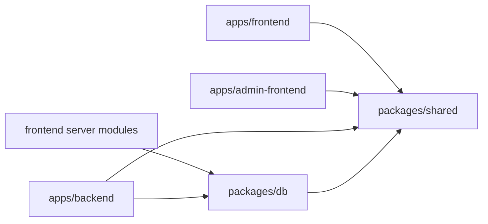

# Portfolio Refactor Master Plan

## Document header

| Field | Value |
|---|---|
| Project name | Portfolio |
| Document purpose | Stable plan and control document for the complete refactor and deployment-preparation program |
| Current architecture | Functional npm workspace with three applications under `apps/`; browser-safe contracts/schemas/constants and canonical project type/status/month helpers owned by `packages/shared`; canonical content connection/models/serializers owned by server-only `packages/db`; project timelines use required `YYYY-MM` starts, validated optional ends, and no stored project year; admin project create/edit share field composition and explicit adapters with hardened media controls |
| Target architecture | npm workspace with `apps/frontend`, `apps/admin-frontend`, `apps/backend`, `packages/shared`, and `packages/db` |
| Deployment targets | Public frontend: Vercel; admin frontend: Vercel; backend: Render free plan; database: MongoDB Atlas |
| Last updated | 2026-07-13 |
| Overall refactor status | In progress; Phases 0 through 4 completed; waiting for the dedicated Phase 5 prompt |

## Goals

- Eliminate repeated contracts, schemas, constants, helpers, and Mongoose models.
- Maintain fast public reads despite Render free-plan sleep/wake latency.
- Establish safe server-only DB sharing and improve admin content management.
- Replace external raw MDX dependencies with database-stored case studies.
- Standardize project types, dates, statuses, technology tags, caching, and revalidation.
- Remove demo artifacts and prepare the project for production deployment.

## Non-goals

- No production-data migration plan is required; production data does not exist.
- No backward compatibility is required for unused schemas.
- No change to the approved public DB-read decision.
- No pnpm, Yarn, Nx, or Turborepo migration unless a later approved ADR explicitly changes this.
- No direct DB access for the admin frontend and no merging of the two frontends.

## Architecture summary

- **Public frontend:** Vercel; public rendering; server-only MongoDB reads via `@portfolio/db`; browser-safe contracts via `@portfolio/shared`; owns public caching, loading/empty/error states, SEO, contact, and protected revalidation endpoint. Mongo credentials and Mongoose never enter client code.
- **Admin frontend:** Vercel; authenticated CMS; uses `@portfolio/shared`; calls backend for auth, protected CRUD, uploads, and mutations; never imports DB code.
- **Backend:** Render; owns authentication, writes, uploads, protected CRUD/operations, validation, and frontend cache revalidation; uses both packages.
- **`@portfolio/shared`:** browser-safe DTOs, Zod schemas, constants, registries, cache tags, and pure helpers; no Mongoose, secrets, DB connection, or app imports.
- **`@portfolio/db`:** server-only Mongo connection, Mongoose models/schemas, and DB helpers; may depend on shared and must never enter browser bundles.



Allowed:

```txt
frontend -> shared
frontend server modules -> db
admin -> shared
backend -> shared
backend -> db
db -> shared
```

Prohibited:

```txt
admin -> db
shared -> db
shared -> app code
client component -> db
```

Each app/package must declare dependencies it directly imports; dependencies must not be centralized only at the root.

## Phase plan

### Phase 0 — Documentation and baseline

- **Objective:** Establish durable scope, decisions, baseline, and trackers before implementation.
- **In scope:** Record structure, apps, locks, scripts, architecture, duplication, readiness gaps, and previously reported validation; create all five documents.
- **Explicitly out of scope:** Moving apps, packages, manifest/lock/source/config/runtime changes, installs, or implementation.
- **Expected deliverables:** Five consistent documents under `docs/`.
- **Validation requirements:** Files exist; phase names match; Phase 0 completed; Phase 1 not started; docs-only diff; no install/migration.
- **Acceptance criteria:** Facts, decisions, blockers, and next action are explicit and trackers agree.
- **Major risks:** Misstating old checks, leaking env values, or starting implementation.
- **Dependencies:** None.

### Phase 1 — Monorepo workspace foundation

- **Objective:** Establish the npm workspace layout without behavioral change.
- **In scope:** Move apps to `apps/`; create both packages; one root lockfile; root scripts/manifests; TypeScript/package boundaries; direct dependency declarations.
- **Explicitly out of scope:** Contract/model extraction, schema, UX, content, or deployment behavior changes.
- **Expected deliverables:** Approved folders, usable package skeletons, workspace scripts, one lockfile.
- **Validation requirements:** Clean install, resolution, lint, typecheck, three production builds, no nested locks, behavior preserved.
- **Acceptance criteria:** All apps validate from root and boundaries work without behavior changes.
- **Major risks:** Aliases, deploy roots, Next tracing, hoisting assumptions, or stale locks.
- **Dependencies:** Phase 0.

### Phase 2 — Shared contracts and database extraction

- **Objective:** Create single owners for browser-safe contracts and server-only DB code.
- **In scope:** Extract DTOs/Zod/constants/helpers/cache tags to shared; connection/models to DB; remove duplicates; enforce import boundaries; isolate admin.
- **Explicitly out of scope:** Persistence behavior, admin redesign, or public-read decision changes.
- **Expected deliverables:** Buildable packages, migrated imports, removed duplicates, enforced boundaries.
- **Validation requirements:** Package/app lint/typecheck/builds, boundary and client-bundle checks, model reuse/serialization/schema behavior.
- **Acceptance criteria:** One canonical owner per contract/model; no admin/client access to DB.
- **Major risks:** Browser-bundled Mongoose, cycles, model recompilation, DTO/serialization drift.
- **Dependencies:** Phase 1.

### Phase 3 — Project schema, type, and date refactor

- **Status:** Completed on 2026-07-13. Canonical values, month timelines, stored-year removal, cross-layer validation, consumer updates, focused tests, and the full workspace validation matrix passed. Interactive browser QA was unavailable because the in-app browser runtime could not bootstrap; safe fixture, source, build, and bundle QA passed and the limitation is recorded in the validation log.

- **Objective:** Canonicalize project classification/month dates and remove stored project year.
- **In scope:** Stable project type/status slugs; `YYYY-MM`; derive year from `startDate`; validate ranges and ongoing projects; update affected layers.
- **Explicitly out of scope:** Data migration/backward compatibility, full media UX, tech registry, MDX.
- **Expected deliverables:** Revised schema/contracts/forms/display with canonical values and no project `year`.
- **Validation requirements:** Valid/invalid month, ordering, ongoing, sort/display tests; lint/typecheck/builds.
- **Acceptance criteria:** Canonical persistence, derived year, invalid ranges rejected.
- **Major risks:** Achievement/project year confusion, ongoing/sort/default regressions.
- **Dependencies:** Phase 2.

### Phase 4 — Admin project form and media UX

- **Status:** Completed on 2026-07-13. Create/edit now share reusable field composition and explicit adapters; dynamic technology entries begin empty; canonical type/month presentation and media upload lifecycle/accessibility/responsive source behavior were hardened; 7 focused admin tests and the full root validation passed. Interactive browser QA was unavailable because the in-app browser runtime could not bootstrap, so the documented component/test/build/static-bundle fallback was used without claiming interactive coverage.

- **Objective:** Professional, aligned create/edit and media workflows.
- **In scope:** Shared type select, month controls, tag/group defaults, image preview/progress/validation/replace/remove.
- **Explicitly out of scope:** Registry internals, MDX, public data, deployment.
- **Expected deliverables:** Unified forms and reusable media controls with clear states.
- **Validation requirements:** Create/edit regression and upload lifecycle QA; lint/typecheck/builds.
- **Acceptance criteria:** Equivalent payloads, stable defaults, accessible/recoverable media actions.
- **Major risks:** Lost state, orphan uploads, create/edit drift.
- **Dependencies:** Phase 3.

### Phase 5 — Technology tag registry

- **Objective:** Standardize known technologies with safe custom fallback.
- **In scope:** Slug/label/aliases/category/brand/safe accent/theme styles; searchable selection; automatic metadata; public rendering.
- **Explicitly out of scope:** Unrelated design work, date schema, MDX.
- **Expected deliverables:** Registry/schema/helpers, admin selector, custom workflow, renderer.
- **Validation requirements:** Uniqueness/alias/known/custom tests, theme QA, lint/typecheck/builds.
- **Acceptance criteria:** Stable known slugs; safe custom tags; legible themes.
- **Major risks:** Collisions, inaccessible colors, unsafe custom styles.
- **Dependencies:** Phase 4 and Phase 2 shared package.

### Phase 6 — Database-stored MDX case studies

- **Objective:** Store authorable case-study MDX in MongoDB and render safely.
- **In scope:** Admin editor/preview, DB field, separate external article URL, controlled renderer/components, validation/fallback/theme styles, remove raw GitHub runtime fetch.
- **Explicitly out of scope:** Arbitrary React execution, external CMS, nonexistent data migration.
- **Expected deliverables:** Contracts/editor/preview/safe renderer and no raw GitHub dependency.
- **Validation requirements:** Valid/invalid/unsafe MDX tests; admin/public/theme QA; lint/typecheck/builds.
- **Acceptance criteria:** Stored MDX renders safely, malformed content fails clearly, article URLs stay separate.
- **Major risks:** XSS, preview mismatch, content size, recovery/theme defects.
- **Dependencies:** Phases 2–5.

### Phase 7 — Public frontend data, caching, and navigation

- **Objective:** Consolidate server public data, reliable caching/revalidation, and navigation states.
- **In scope:** DB package in server modules, standardized repositories, shared cache tags, mutation revalidation, home/about active state, loading/empty/error review.
- **Explicitly out of scope:** Public reads through Render, admin redesign, deployment execution.
- **Expected deliverables:** Consistent repositories/cache vocabulary, verified invalidation, resilient states.
- **Validation requirements:** Import/caching/visibility/revalidation checks, navigation/state QA, lint/typecheck/builds.
- **Acceptance criteria:** Server-only fast reads, fresh post-mutation data, correct UI states.
- **Major risks:** Stale/overbroad cache, client imports, rendering/hydration issues.
- **Dependencies:** Phases 2 and 6.

### Phase 8 — Seed/demo and repository cleanup

- **Objective:** Remove non-production data/assets/artifacts and standardize hygiene.
- **In scope:** Remove obsolete seeds/sample data/media/seed-only behavior/logs/generated metadata; retain genuine assets; standardize ignores/env examples.
- **Explicitly out of scope:** Unreviewed genuine-content deletion, unrelated behavior, approval.
- **Expected deliverables:** Production-focused tree and safe standardized templates.
- **Validation requirements:** Inventory/reference checks, lint/typecheck/builds, artifact/secret scan.
- **Acceptance criteria:** No obsolete demo coupling, assets resolve, artifacts untracked, examples safe.
- **Major risks:** Genuine asset loss, broken references, leaked examples.
- **Dependencies:** Phases 1–7.

### Phase 9 — Deployment, security, SEO, CI, and documentation

- **Status:** Completed on 2026-07-14.
- **Objective:** Complete production config, security, discoverability, automation, and operator docs.
- **In scope:** Domain cookie/CORS choice; Vercel/Render env docs; CI; sitemap/robots/metadata/config; Atlas/ImageKit/remote images; root README/deployment guide.
- **Explicitly out of scope:** Premature readiness, repository secrets, public-read change.
- **Expected deliverables:** Config/docs, CI, SEO, security decisions, guide.
- **Validation requirements:** CI/config/build/env/cookie/CORS/SEO checks and audit review.
- **Acceptance criteria:** Safe operator setup, enforced CI, explicit domains/security/SEO/warnings.
- **Major risks:** Cross-site cookies, permissive CORS/Atlas, missing env, wrong deploy roots.
- **Dependencies:** Phases 1–8 and confirmed domains.

### Phase 10 — Final QA and deployment readiness

- **Status:** Completed on 2026-07-15 for the authorized repository QA, release-gating, and deployment-readiness documentation scope. External prerequisites and deployed verification remain required.
- **Objective:** Prove reproducibility and readiness for approval.
- **In scope:** Clean install; all lint/typecheck/build/tests; public/responsive/themes/admin auth/CRUD/uploads/cache/MDX QA; smoke tests; verdict.
- **Explicitly out of scope:** Hidden failures, unrecorded waivers, unrelated features, committed build proof.
- **Expected deliverables:** Complete evidence and final verdict/approval record.
- **Validation requirements:** Full matrix, end-to-end/deployed QA, secret/artifact scan, tracker consistency.
- **Acceptance criteria:** Global definition met, no blocker, approval and approver recorded after review.
- **Major risks:** Environment-only/intermittent defects, shallow device QA, premature approval.
- **Dependencies:** Phases 0–9 completed or explicitly deferred without a readiness violation.

## Global completion definition

### Phase 5 implementation note (2026-07-14)

Phase 5 completed on 2026-07-14: the shared canonical registry, persistence union, validation, DB model, admin selector, public badge resolver, seed/demo fixture conversion, and approved fallback QA are complete. Interactive browser QA remains an environment limitation tracked for Phase 10. Phase 6 remains not started.

The refactor is finished only when the approved workspace and single lockfile exist; direct dependencies and boundaries are correct; shared/DB duplication is removed; Phases 3–8 meet acceptance criteria; public reads remain server-only with verified cache revalidation; production security/config/SEO/CI/docs are complete; clean-install plus relevant automated, manual, and deployed checks are recorded truthfully; the deployment tracker has no blockers and a dated approver; and all five documents agree. Deferrals must be explicit and cannot violate acceptance or readiness requirements.

## Change-control rules

### Phase 7 implementation note (2026-07-14)

Phase 7 completed: public reads are owned by server-only repositories with DTO serialization, deterministic visibility ordering, canonical cache keys/tags, slug-aware mutation invalidation, bounded revalidation failures, explicit public rendering states, client-side project filtering, and aligned quick navigation. Automated/fallback validation passed; interactive browser and deployment readiness checks remain deferred. Phase 8 remains not started.

### Phase 8 implementation note (2026-07-14)

Phase 8 cleanup is in progress: obsolete seed scripts/commands, static demo records, confirmed sample media, seed-only media IDs, and frontend direct Mongoose ownership have been removed; safe environment examples, asset checks, and active content-management documentation have been updated. Final aggregate validation and the authoritative completion checkpoint remain outstanding. Phase 9 has not started.

### Phase 8 final state override (2026-07-14)

Phase 8 is Completed. Seed/demo coupling, confirmed sample media, automatic personal settings defaults, and the frontend seed-only Mongoose dependency were removed; environment examples, ignore rules, active documentation, asset checks, and focused empty-data tests are complete. Approved root validation passed. Phase 9 remains Not started; deployment and interactive-browser readiness remain later work.

### Phase 9 implementation note (2026-07-14)

Phase 9 is in progress: deployment/security inventory, environment-driven cookie/CORS/proxy validation, readiness and shutdown handling, SEO metadata/sitemap/robots/structured data, admin indexing protection, CI, Render/Vercel preparation, audit review, and deployment documentation are being implemented. No live deployment or Phase 10 work has started.

### Phase 9 final state override (2026-07-14)

Phase 9 is Completed. Environment/security hardening, deployment preparation, SEO, CI, dependency review, and operational documentation passed the approved full validation matrix. Live provider configuration, deployed smoke tests, backups, final CSP, interactive browser QA, and approval remain explicitly deferred to Phase 10; no live operation or Phase 10 work was performed.

- Only one primary phase should be active at a time.
- Do not start a later phase until the current phase is completed or explicitly deferred.
- Every implementation prompt must update permanent trackers.
- Record scope/architecture changes in `architecture-decisions.md`.
- Never hide failed validation/warnings or document secrets/complete environment values.
- Do not commit generated output merely to prove a build ran.

## Tracker update rules for every future Codex task

1. Read all five refactor documents before starting a phase.
2. Confirm the active phase and allowed scope.
3. Update `refactor-progress.md` before changing code.
4. Update the current phase checklist after every meaningful change group.
5. Append progress; do not rewrite history.
6. Record architecture deviations in `architecture-decisions.md`.
7. Record commands and outcomes in `validation-log.md`.
8. Update deployment-related items in `deployment-readiness.md`.
9. Keep `Current blockers` accurate.
10. Keep `Exact next action` accurate.
11. Do not mark a phase complete until acceptance and validation are satisfied.
12. Mark incomplete phase work `Partially completed`, not `Completed`.
13. On stopping, make continuation possible without the Codex chat.
14. Never place secrets or complete environment values in documentation.
15. The final Codex response must agree with repository trackers.
### Phase 6 implementation note (2026-07-14)

Phase 6 completed on 2026-07-14. Project case studies are now optional database-stored `caseStudyMdx` content with shared UTF-8 byte limits and controlled syntax validation. The admin create/edit flow provides a write/preview editor using the same GFM/slug toolchain as the public renderer; external article links remain separate. The public frontend no longer fetches or normalizes raw GitHub MDX URLs and renders stored content through an allowlisted component boundary with safe URL handling and a controlled fallback. No migration, seed execution, or live database operation was performed.

### Phase 7 final state override (2026-07-14)

Phase 7 is Completed. Phase 8 and later remain Not started. The next action is to wait for the dedicated Phase 8 prompt; deployment and interactive-browser readiness remain later verification work.

### Phase 10 final state override (2026-07-15)

Phase 10 is Completed for the authorized repository scope. The release
classification is **Ready for staged deployment with external prerequisites**.
No live deployment, external provider operation, credentials, production
database/media/email operation, seed, migration, revalidation, or interactive
browser pass was performed. The next action is to follow
`docs/final-deployment-checklist.md` and record staged evidence with
`docs/post-deployment-smoke-test.md`.
